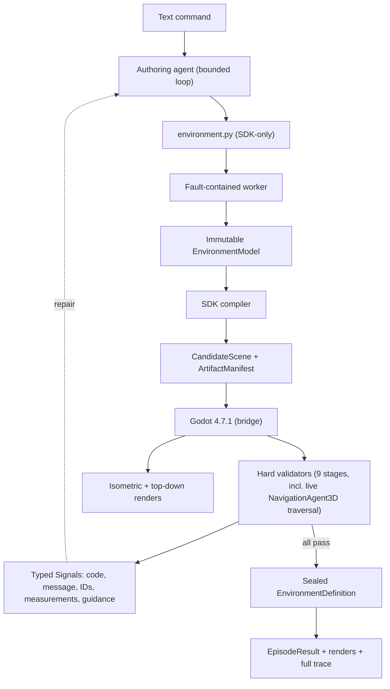
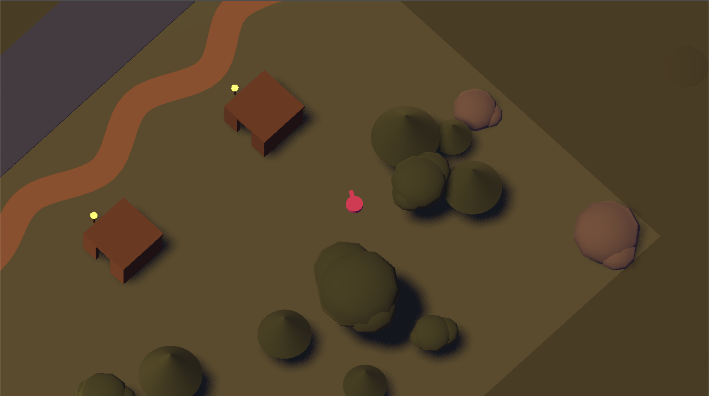

# EnvMaker

Hi! This is my submission to the challenge. EnvMaker turns a text prompt ("a stone courtyard with a banner at the east gate") into a playable, validated Godot world that an agent walks through.

Environments render as organic 2D low-poly isometric scenes (like a Hades-style camera). 

The authoring model writes a small Python program against an SDK containing parametric kits, 2D footprint geometry, and certain props. This method was inspired by [Articraft](https://arxiv.org/html/2605.15187v1#S3), a harness for generating 3D models that used a similar SDK. The agent can also theme the world by editing color palattes, generating custom materials, lighting, and other small primitive kits (`examples/alien/environment.py` is a sealed alien world built this way).

Here is a small system diagram:




And an example generated world, with the following prompt:

```
A riverside shrine at dusk: a river crosses one side of the map, and a winding dirt path follows its bank from the agent's spawn to a small shrine that glows warm gold at the far end. Deep indigo sky fading to amber at the horizon, dusky muted-green ground. Two timber huts sit along the path with small glowing amber lanterns beside their doors. Pines and oaks of varied sizes and rotations cluster loosely away from the path, with a few boulders anchoring the corners. Keep the riverbank and the full path clearly visible and unobstructed.
```



## Running it in Claude Code

Clone the repository, start Claude Code at the repo root (I use the terminal), and ask in plain English:

> Use the envmaker harness to create an environment that consists of a green field with several scattered boulders.

Claude picks up the workflow from `CLAUDE.md` automatically. It installs dependencies, downloads the pinned Godot build if it's missing, writes the environment program itself, runs the validators, looks at the renders, repairs until every check passes, and then opens the finished world in a window with the agent wandering around it. Claude is the authoring model here; the harness never calls an external API. 

## Running it in the Terminal

Python 3.12 and [uv](https://docs.astral.sh/uv/) are the only prerequisites; a script fetches the pinned Godot 4.7.1 build (macOS verified; Linux x86_64/arm64 and Windows served by the same script, or set `GODOT_BIN=<path>` to use your own binary).

You also need to create a .env file and set an OPENAI_API_KEY environment variable, or type the following command in your terminal:

```bash
export OPENAI_API_KEY=sk-...
```

Then:

```bash
uv sync
uv run python scripts/get_godot.py
```

```bash
# Validate the checked-in fixture end to end and watch it run.
uv run envmaker demo --view

# Keyless contract suite: pytest, the Godot in-engine harness, and the demo.
uv run envmaker check

# Autonomous authoring loop (needs OPENAI_API_KEY in .env);
# --open shows the accepted world when it finishes.
uv run envmaker run "a frozen village with a walled square and a watchtower" --open
```
