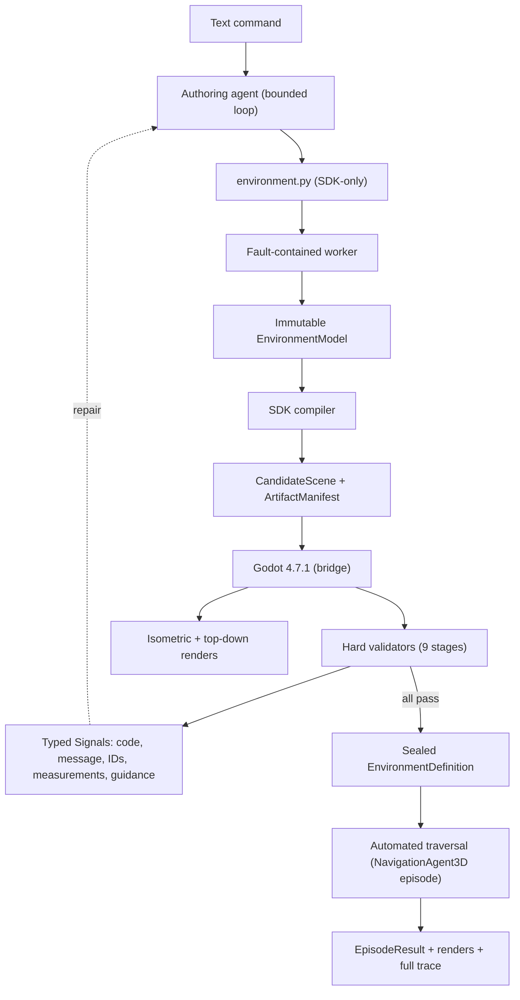

# Architecture — Agentic Isometric Environment Generation (Focused MVP, Revision 2)

## Scope and thesis

`envmaker` is an agent harness that accepts a text command and produces a playable, navigable environment. An authoring agent writes one readable Python program against a constrained SDK; a fault-contained worker executes it into an immutable `EnvironmentModel`; a compiler turns the model into a `CandidateScene`; Godot 4.7.1 materializes, collides, navigates, and renders it; harness-owned validators return typed, bounded feedback; the agent repairs the program; an automated agent traverses the accepted environment. The generated product is an immutable `EnvironmentDefinition`; environments carry no objectives, rewards, progression, or game rules.

The central research claim:

> Under a bounded generation budget, a focused environment-authoring SDK plus structured execution feedback produces valid, navigable environments more reliably than one-shot environment code generation.

The MVP is deliberately **3D-lite**: visually 3D and isometric, logically close to a 2D navigation environment. The research contribution is the agentic authoring-and-repair loop — not custom 3D locomotion. Godot is retained because it provides real scene materialization, collision, navigation, rendering, headless execution, and programmatic inspection. Isometric presentation is retained because it produces a visually compelling and legible reviewer demo. Navigation is constrained to a mostly planar world; a top-down diagnostic view keeps failures understandable. True multilevel 3D traversal is a natural extension (see Deferred research extensions) but is not necessary to demonstrate the central claim.

## Current implementation state

Complete and frozen (see `.superpowers/sdd/interfaces.md` and the ledger):

- **Toolchain:** Python 3.12 via uv; Godot 4.7.1 at `tools/godot/`; `scripts/verify_toolchain.py` hard-gates both.
- **Core contracts (`envmaker.core`):** canonical fingerprints and content-addressed `ArtifactRef`/`ArtifactManifest` (BLAKE2b-256 identity + SHA-256 engine digest); bounded typed `Signal`s; `PromptRequirementSet`; `EnvironmentProgram` + fault-containment `WorkerExecution` records; metre-based `Vec3`/`Transform3D`; `EnvironmentModel`; `GodotSceneSpec`/`CandidateScene`; `WorldSnapshot`/`ObservationPacket`/`ControllerAction`; `NavigationProbe`/`EpisodeResult`; nine-stage `ValidationBundle`; `seal_definition`/`require_definition` with the candidate-vs-accepted type separation.
- **Bridge:** versioned JSON envelopes with session/request correlation and simulation tick IDs; 4-byte big-endian length-prefixed framing (1 MiB control cap, fatal poisoning); run-root `ArtifactStore`; protocol-faithful fake runner; `BridgeServer`/`BridgeSession`; sanitized `GodotProcess` (env-only credentials); the Godot project with autoloaded bridge, artifact loader, in-engine test harness, and live handshake integration tests.

Four documented amendments govern where the MVP deviates from the original larger design: runtime GLB loading is formally deferred; the nine-stage bundle is retained with lean stage mappings; `SceneNode` gains an additive optional `visual` field under an `omit_when_none` canonical-serialization rule that keeps every pre-existing fingerprint byte-identical (guarded by a pinned-fingerprint regression test); dormant frozen enums (stairs/bridge connectors, RGB observations) remain frozen and unused.

## System overview



## Runtime model (3D-lite)

- The agent moves primarily on the horizontal XZ plane; most walkable terrain is flat. Gentle variation is permitted only through standard Godot navigation and movement APIs, with no custom traversal logic.
- Movement: one `CharacterBody3D` with `move_and_slide()`, driven per tick by planar velocity — a single controller implementation. Interactive human control is deferred; the windowed view mode replays automated traversal.
- One authoritative walkable surface: exactly one ground component creates the walkable collision/navigation surface; paths are visual-only overlays (no collider, no navigation contribution); water, walls, obstacles, and structures are physical blockers whose solid colliders carve navigation; scatter kits declare `blocking` explicitly, never implicitly; no overlapping coplanar floor geometry.
- Navigation: `NavigationRegion3D` baked at runtime over the materialized static geometry; `NavigationAgent3D` paths to targets. Automated navigation may use privileged navigation/scene-state information; it is not required to operate from rendered pixels.
- Obstacles, buildings, vegetation, and landmarks are simple 3D geometry with explicit 2D footprints; walkability stays simple and inspectable.
- Traversal episodes are evaluator-owned `NavigationProbe`s (target, success radius, tick budget, action repeat, stuck timeout, guaranteed-termination reasons) answered by `EpisodeResult`s.

### Camera and required views

Two camera modes over the same materialized environment — never separate implementations:

1. **Isometric policy/reviewer view** — the primary presentation. Fixed orthographic projection and orientation (yaw 45°, pitch 35.264°); position follows the agent deterministically; no debugging overlays. Neither the policy nor the generated program can orbit or reorient it.
2. **Top-down diagnostic view** — for debugging generation and navigation. May display walkable regions, obstacle footprints, routes, spawn, and target markers.

The isometric view demonstrates visual quality; the top-down view makes failures understandable.

### Explicit MVP exclusions

Not required for completion, never in acceptance gates: stacked walkable floors; general multilevel navigation; custom step-up/step-down; custom swept collision or depenetration; stable contact ordering; complex slope handling; jumping or free flight; traversable roofs; moving platforms; arbitrary bridge/stair traversal; camera orbit or agent-controlled orientation; roof/façade fading and multi-occluder handling; pixel-based navigation; exact trajectory replay. These live only under Deferred research extensions.

## Agent harness

### Generated program contract

The only writable authoring artifact is `environment.py`:

```python
def build_environment() -> EnvironmentModel:
    ...

environment = build_environment()
```

The program describes semantic world content only — regions, ground, paths, water, obstacles, structures, landmarks, vegetation/scatter, materials by curated name, spawn points, and camera intent (orthographic size). It never encodes camera-space coordinates, isometric projection logic, screen-space placement, visibility tricks, Godot scene files, GDScript, GLB bytes, navmesh resources, raw vertex buffers, or filesystem/shell operations. This separation makes it possible to render the same environment through more than one diagnostic view without changing the generated source.

### Fault containment (not a hostile-code sandbox)

Before execution the harness parses the AST and rejects anything outside the import allowlist (`envmaker.sdk`, `math`) plus `exec`/`eval`/`open`/`__import__`/dunder-attribute access. Execution happens in a disposable subprocess with a temporary working directory, sanitized environment, wall/CPU timeout, and output-size cap; the model returns as canonical JSON over a pipe and is re-validated parent-side. Non-completed runs are quarantined per the `WorkerExecution` contract. This is accidental-fault containment; the documentation never claims a hostile-code security boundary.

### Tool surface (complete)

| Tool | Purpose |
|---|---|
| `read_program` | Read the current `environment.py` |
| `patch_program` | Apply a size-capped localized source edit |
| `compile_environment` | Worker execution + SDK compile + validators V1–V5 |
| `probe_environment` | Read-only, bounded measurements over the model/scene |
| `render_environment` | Isometric or top-down render, returned as artifact refs |
| `simulate_navigation` | Live-runtime connectivity + traversal (V6–V7) |

Feedback is always typed `Signal`s: stable failure code, human-readable explanation, affected semantic IDs, relevant measurements, and a suggested repair direction. The harness never dumps unbounded engine logs into model context.

### Iteration and stopping

Each turn: read → patch → compile/probe/render/simulate → feedback. Generation stops on acceptance (all nine hard stages pass) or exhaustion (turn, wall-time, or token budget). Hard-validity status is harness-owned and cannot be waived by generated tests. Exhaustion preserves the best candidate and the complete trace; a hard-invalid candidate is never accepted or silently repaired by the harness.

## EnvMaker SDK

Small, composable, footprint-first. Geometry is expressed through horizontal footprints and heights; the compiler realizes them as primitive boxes and cylinders (plus the single ground plane) with matching colliders — never mesh extrusion.

```python
builder = EnvironmentBuilder("jungle_valley", seed=7)

builder.ground("valley", footprint=Polygon2D([(-20, -20), (20, -20), (20, 20), (-20, 20)]), material="grass")
builder.path("trail", points=[(-15, -15), (0, 0), (12, 10)], width=2.0, material="dirt")
builder.water("river", footprint=Polygon2D([(-20, 2), (20, 2), (20, 6), (-20, 6)]))
builder.wall("rampart", start=(-8, -10), end=(8, -10), height=2.5, thickness=0.4, material="stone")
builder.obstacle("boulder_field", footprint=Polygon2D([(4, -4), (9, -4), (9, 1), (4, 1)]), height=1.5, material="rock")
builder.structure("ruined_observatory", footprint=Polygon2D([(10, 8), (16, 8), (16, 14), (10, 14)]), height=4.0, kit="stone_ruin")
builder.landmark("obelisk", position=(-12, 12), kit="obelisk")
builder.scatter("trees", region="valley", kit="pine", count=40, min_spacing=2.0)
builder.spawn("agent", position=(-15, -15))
builder.camera(orthographic_size=14.0)

environment = builder.freeze()
```

Concepts: `ground`/region, `path`, `water`, `wall`, `obstacle`, `structure`, `landmark`, `scatter`, `spawn`, `camera`. Structures come from curated kits (parametric box/cylinder assemblies: `stone_ruin`, `timber_hut`, `watchtower`, plus landmark/vegetation kits, each with an explicit blocking declaration); scattering is deterministic from the model seed. `freeze()` returns the immutable, fingerprinted `EnvironmentModel`; mutation afterwards raises. The builder validates names, references, footprint finiteness/simplicity, and kit existence at authoring time so failures surface as early, well-located signals.

`compile_environment_model(model) -> CandidateScene` maps components to `SceneNode`s carrying shape-specific visuals (boxes and cylinders, plus the one ground plane), primitive colliders, and navmesh-contributor flags under the authoritative walkability rules: the single ground is the walkable surface; paths are visual-only offset strips; water, walls, obstacles, and structures materialize as physical blockers (footprint-declared blockers become their minimum-area oriented bounding box; walls come from start/end/thickness/height); scatter kits carry explicit blocking declarations. `Polygon2D` drives placement, overlap checks, and semantic footprints — never raw mesh extrusion.

## Core data contracts

Unchanged from Tasks 1–2 (exact signatures in `.superpowers/sdd/interfaces.md`): `PromptRequirementSet`, `EnvironmentProgram`, `WorkerExecution`, `EnvironmentModel`, `ArtifactRef`/`ArtifactManifest`, `GodotSceneSpec`/`CandidateScene`, `WorldSnapshot`/`ObservationPacket`/`ControllerAction`, `NavigationProbe`/`EpisodeResult`, `StageReport`/`ValidationBundle`/`EnvironmentDefinition` with `seal_definition`/`require_definition`.

MVP additions (additive only): the shape-specific `BoxVisual`/`CylinderVisual`/`PlaneVisual` discriminated union and `SceneNode.visual` (optional, under the `omit_when_none` canonical rule so pre-existing fingerprints are unchanged); the SDK's `Polygon2D`.

## Godot runtime

### Process boundary

Python owns orchestration; Godot owns scene materialization, collision, navigation, rendering, and window lifecycle. The harness starts Godot headless (or windowed for `demo --view`) via the sanitized process manager; credentials travel env-only; the bridge connects to the loopback listener and authenticates with the per-run token. The versioned protocol (hello, load_candidate, navigation_status, reset, step, snapshot, render, probe, close) carries session/request correlation IDs on every message and monotonic tick IDs on simulation messages. Control messages are bounded JSON; binary artifacts — including renders — move through the content-addressed run root and are referenced, never embedded. Framing errors are fatal; abuse (duplicate IDs, stale ticks, queue overflow, oversized frames, bad tokens) closes the connection with typed signals and documented exit codes.

### Materialization

`load_candidate` carries the canonical `CandidateScene` JSON. The materializer instantiates, per node: a `StaticBody3D` with the shape-matched primitive collider (BoxShape3D, CylinderShape3D; the ground plane materializes as a thin floor slab), a `MeshInstance3D` with the shape-matched primitive mesh (BoxMesh, CylinderMesh, PlaneMesh), a runtime-created `StandardMaterial3D` from the curated material name, and semantic-ID metadata. Visual-only nodes (paths) receive no collider. Visual specs are shape-specific (`BoxVisual`/`CylinderVisual`/`PlaneVisual`, discriminated by `shape`) so invalid combinations are unrepresentable and authoring mistakes produce precise validation errors; polygon mesh extrusion is deferred. The agent is one `CharacterBody3D`. Lighting is one directional light plus ambient. `navigation_status` exposes the real bake state machine (`unloaded → parsing → baking → ready | failed`); no probe is answered before `ready`.

### Navigation and traversal

`NavigationRegion3D` bakes at runtime over the materialized statics. A `probe` request carries a `NavigationProbe`; the episode runs entirely in-engine — `NavigationAgent3D` pathing, per-tick planar velocity through `move_and_slide()`, arrival radius, stuck timeout, tick budget — and returns the `EpisodeResult` fields plus `planned_path_length_m`. Traversal evidence must show genuine navigation, not open-field walking: the gating scenes block the straight route, and assertions require the planned path ≥ 1.15× the Euclidean spawn→target distance with actual travel within 15% of the planned length. Renders (`render` request, `view: isometric | topdown`) are written under the run root and returned as path + size + SHA-256; the Python driver ingests them into the `ArtifactStore` (BLAKE2b identity) as verified `ArtifactRef`s.

## Compilation, feedback, and validation

Seven substantive hard validators, mapped onto the frozen nine-stage `ValidationBundle` (every stage always reports):

| Stage | Check |
|---|---|
| program | generated program executes (worker completed; model returned) |
| sdk_model | public SDK contract respected (exact entrypoints; frozen model) |
| semantic | references and semantic IDs valid |
| asset | geometry and transforms finite and within world bounds |
| scene | spawn does not intersect blocking geometry |
| materialization | Godot load succeeded |
| navigation | sufficiently large connected navigable region |
| controller | a sampled route is traversed in the actual Godot runtime |
| camera | render captured and ingested as a verified artifact |

Failed stages carry `Signal`s (stable code, message, subject IDs, measurements, repair guidance). Generated prompt-specific tests are optional and subordinate: they never count as hard evidence and cannot waive harness-owned gates. Only a nine-stage all-pass bundle can seal an `EnvironmentDefinition`. Repairs edit source only — the harness never silently changes a failing program's semantics.

## Telemetry and artifacts

Every run directory preserves the complete story, failures included:

```text
runs/<run_id>/
  prompt.txt              # or fixture provenance
  environment.py          # every revision retained (environment.rev-N.py)
  trace.jsonl             # turns, tool calls, signals, budgets, outcomes (redacted)
  candidate-scene.json
  artifact-manifest.json
  artifacts/<digest>.<ext>   # renders and file artifacts, content-addressed
  validation.json         # the nine-stage bundle
  episode.json            # EpisodeResult
  result.json             # accepted/rejected, budgets used, fingerprints
```

Secrets and absolute host paths are redacted from traces. Saved accepted programs re-run without an API key.

## Reviewer contract

```bash
uv run envmaker demo --headless     # keyless end-to-end fixture: recompile, materialize,
                                    # validate, traverse, render, report
uv run envmaker demo --view         # same, in a window that visually plays the automated traversal
                                    # (isometric view, optional top-down toggle; human control deferred)
uv run envmaker run "<prompt>" --seed 7    # live authoring with visible compile/repair events;
                                    # terminal states: accepted | rejected_after_budget |
                                    # provider_error | harness_error (only the last two are system failures)
uv run envmaker check               # fast keyless suite, non-recursive: explicit pytest list
                                    # (tests --ignore=tests/cli) + Godot harness + headless demo
```

Operational notes: Godot-spawning commands run unsandboxed (Godot writes `~/Library/Application Support`); in-engine gates key on the anchored `RESULT: <n> checks, 0 failures` line plus exit code.

## Evaluation

Small and honest: six frozen prompts (jungle valley with river and ruins; frozen village; desert canyon; industrial yard; island settlement; maze-like garden) × two seeds, each run under two variants — **A: one-shot generation** (single pass, no tools, no feedback) and **B: the full loop**. Frozen identically across variants: the model, the SDK documentation shown to it, the prompt contract, the seeds, and the total token/cost budget; the only experimental difference is the availability of iterative tools and feedback. Metrics: program execution rate, hard-valid environment rate, traversal success rate, average repair turns (B), generation latency, and requirement coverage via a small human-auditable checklist. Runs are classified by the terminal-state taxonomy (`accepted`, `rejected_after_budget`, `provider_error`, `harness_error`); the deterministic scripted repair fixture is the hard gate, and live runs are preserved evidence. The report keeps failed examples and states limitations. No large corpora, ablation grids, blinded raters, or confidence intervals — the claim is evidenced by the A/B contrast on a compact, fully inspectable set.

## Deferred research extensions

1. **Procedural geometry and novel asset generation** — arbitrary/convex polygon mesh extrusion with matching colliders, CAD recipes (CadQuery/OCCT), BRep lineage, CSG recovery, mesh QC, runtime GLB loading, asset caching.
2. **Multilevel traversal and stronger controllers** — stairs/ramps/bridges/terraces, navigation links, custom stepping/sweeps/depenetration, slope handling, interactive human control (WASD).
3. **Visual critique and visual repair** — multimodal critics, defect schemas, audit status, occlusion fading, pixel-art style profiles.
4. **Vision-based navigation policies** — RGB policies, semantic-frontier exploration, LLM navigators, anti-triviality baselines, per-tick action streaming.
5. **Spatially infinite chunk streaming** — chunk recipes, portal contracts, schedulers, mutation persistence, origin rebasing, churn benchmarks.
6. **Task, reward, and post-training overlays** — code-level objectives, reward models, curricula.
7. **Large-scale evaluation and ablations** — held-out corpora, multi-variant ablations, blinded raters, bootstrap statistics, replay studies.

## Module map

```text
pyproject.toml            .python-version           uv.lock
scripts/verify_toolchain.py
src/envmaker/
  __init__.py  cli.py  runtime.py  validation.py  runlog.py  evaluation.py
  core/        artifacts.py contracts.py signals.py requirements.py program.py
               model.py scene_spec.py interaction.py episode.py definition.py
  godot_bridge/ protocol.py client.py process.py fake.py
  sdk/         __init__.py builder.py footprints.py kits.py compile.py
  agent/       __init__.py worker.py tools.py loop.py providers.py prompts.py
godot/
  project.godot  scene/main.tscn
  bridge/        bridge.gd protocol.gd
  scene/         artifact_loader.gd materializer.gd nav_runtime.gd
                 agent_controller.gd camera_rig.gd
  tests/         run_all.gd
examples/
  spine/         candidate-scene.json artifact-manifest.json
  demo/          environment.py
evals/           mvp.yaml mvp-report.md
tests/           core/ godot_bridge/ spine/ sdk/ agent/ e2e/ cli/
```
