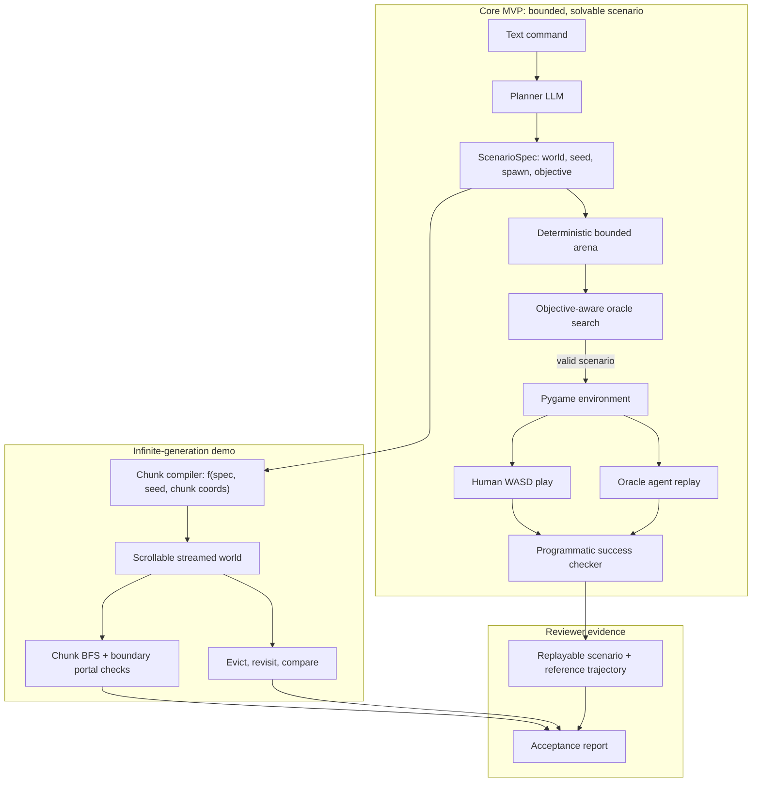
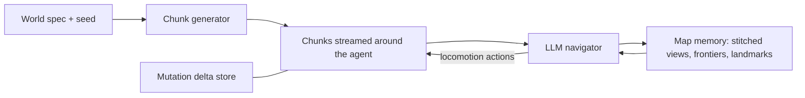

# Architecture — Environment Generation Harness

The submission prioritizes one complete, reviewer-runnable path: an open-ended text command becomes a typed 2D scenario, a deterministic compiler builds a bounded arena, an oracle proves its objective solvable, and a human or agent can play it in pygame. Success is checked from engine state rather than pixels.

The same compiler also powers a separate infinite-generation demonstration. A scrollable viewer streams deterministic chunks as the camera moves, evicts them, and regenerates them identically on return. Keeping this demo separate from episodic tasks avoids claiming that a finite search proves arbitrary reachability over an infinite domain.

The architecture is divided by submission priority:

1. **Core MVP — bounded, solvable scenarios.** Text command → typed `ScenarioSpec` → deterministic arena → objective-aware validation → pygame play → programmatic success.
2. **Infinite-generation demo.** Unbounded chunk streaming, seam and boundary-portal checks, unload/reload determinism, and seed diversity.
3. **Stretch research extensions.** LLM navigation, automated repair, live editing, larger batch evaluation, trajectory export, and eventual 3D transfer.

"Infinite" therefore has two demonstrated meanings: unbounded extent in the viewer and unbounded supply across prompts and seeds. Task solvability remains a precise claim about each generated bounded episode.

## System overview



## Core MVP — bounded, solvable scenarios

### Scenario spec (`spec.py`) and planner (`planner.py`)
The planner compiles a text command into a typed pydantic `ScenarioSpec` containing:

- world style and biome constraints;
- supported declarative topology primitives such as rooms, corridors, clearings, and obstacle-density ranges;
- landmark and entity rules;
- arena size, agent spawn constraints, and world seed;
- one core objective — `reach` or `collect` — with target-placement constraints.

The planner selects from capabilities the engine actually implements; it emits neither executable code nor an unrestricted tile map. Schema validation rejects unsupported fields, and the accepted spec is snapshotted so every downstream result is deterministic and replayable without an API key.

### Bounded arena compiler (`compiler/arena.py`)
The compiler turns `ScenarioSpec` into a finite arena using the same coordinate-based terrain functions as the streaming demo. It places the spawn and objective only after walkable geometry exists, then submits the complete episode to objective-aware validation. This bounded scenario is the default for `run`, human play, oracle replay, and evaluation.

### Chunk compiler (`compiler/`, `engine/chunks.py`)
Chunks are pure functions `f(world_spec, world_seed, chunk_coords)`:

- Terrain comes from globally-seeded noise fields (biome, elevation, moisture) evaluated at absolute coordinates, so chunk borders agree by construction — rivers and paths do not die at seams.
- Landmarks are placed by deterministic hashing over the chunk lattice (Poisson-disk-style spacing).
- Revisited terrain re-derives identically with zero storage; "world memory" is a corollary of determinism, not a database.

### Static collision semantics (`engine/world.py`)
Tiles carry walkable / blocked / hazard semantics from day one — the renderer tints them and the traversability validator consumes them. No dynamics exist yet; that is deliberate. Statics live in layer 1; the physics engine proper — movement, collision resolution, contact events — is layer 2.

### Traversability validation and repair (`validate/`, `repair.py`)
The world must be *theoretically* traversable before any agent exists: connectivity is favored by construction (connectivity fields, corridor carving) and verified by windowed BFS over sampled neighborhoods. Failures become structured errors; deterministic fixes handle mechanical problems, the LLM patches the spec for semantic ones — targeted patches, never full regeneration, bounded attempts, all logged.

### Scrollable viewer (`engine/viewer.py`)
`envforge view world.json` opens a pygame window with a free camera (WASD/arrows/drag) over the infinite world — the primary instrument for verifying infinite generation: pan thousands of tiles, inspect seams with the chunk-border debug overlay, leave and return to confirm determinism. `--export` stitches a region into a PNG for the README.

## Layer 2 — traversal

### Dynamics (`engine/physics.py`)
The step loop: actions → movement → collision resolution → contact events. Interactions are contact-triggered — walk over an item to pick it up, into a keyed door to open it, onto a pressure plate to press it, into a delivery zone to deposit — so every objective is completable by locomotion alone and the action space stays pure movement.

### Environment (`engine/env.py`)
Gym-style API over the streaming world: `reset() -> obs`, `step(action) -> obs, reward, done, info`. Chunks materialize on demand as the agent moves; a per-chunk **delta store** persists mutations (taken items, opened doors) on top of re-derivable terrain; every step can capture a rendered frame. A pygame window provides human WASD play (`play` command) — the brief requires *playable* environments, so human play is a first-class mode.

### Agents (`agents/`)
Two navigators with different jobs:

- **Oracle** — pathfinding over privileged windowed state. A validation instrument: reachability proofs, difficulty estimates, reference trajectories.
- **LLM navigator** — sees an egocentric window and carries **map memory**: an explored map stitched from what it has seen, frontier tracking for exploration, landmark bookmarks for returning home. In an infinite world partial observability is structural — there is no full map to show — so memory is a requirement, not a styling choice. Observation is a configurable knob (`--obs egocentric|full`; full-map is only meaningful in bounded arenas), and the eval reports success rates per mode.



## Layer 3 — tasks, verification, scale

### Objectives as code (`verify.py`)
Reach / collect / pick-up-and-deliver / activate-sequence objectives are placed into worlds and compiled to programmatic success checkers and reward functions — code-level truth, no pixel inspection. For episodic RL semantics and a full BFS solvability proof, a **bounded arena** clips a finite window out of the same generation machinery.

### Iterative commands
`envforge edit` applies follow-up text commands as spec patches — the same machinery as repair. Mid-roam re-prompts alter regions not yet generated: continuous, language-driven world extension.

### Batch evaluation
`envforge batch evals/prompts.yaml`: specs × seeds → generation success before/after repair, traversability rate, agent-vs-oracle success, diversity and difficulty distributions, rendered into a markdown report. This is the "infinite supply" evidence — reliability measured, not claimed.

### Artifacts (`runlog.py`)
Each run writes `runs/<id>/`: replayable world/task JSON (works without API keys), a JSONL trace of every stage, a human-readable report, and a GIF. Trajectory export (stretch) adds per-step paired records — rendered frame, programmatic state and events, reward — the paired data General Intuition describes for reward-model training.

## Note on the vision-based policy
The policy section of the brief is context about General Intuition's 3D setting; the policy is needed only for 3D navigation, and in 2D "models like Claude perform well... on their own." The 2D navigator therefore does not mimic the policy interface. What the design keeps are environment-side properties that make generated worlds consumable by such a policy after a 3D transfer — and that are simpler to build anyway: contact-triggered interactions (objectives completable by locomotion alone), a Gym-style mount point on the agent entity, per-step frame rendering.

## Module map

```
src/envforge/
  cli.py            typer entry points: worldgen, view, play, roam, run, edit, batch, replay
  spec.py           world spec + objectives + seed (pydantic)
  planner.py        LLM: text command -> world spec
  compiler/         noise fields, primitives, compile
  engine/           world.py, chunks.py, physics.py, env.py (Gym-style), render.py, viewer.py
  validate/         static checks, windowed BFS traversability
  repair.py         bounded spec-patch repair (shared with edit)
  agents/           oracle.py, llm_agent.py, memory.py
  verify.py         objective checkers + reward functions
  llm.py            provider-agnostic client (Anthropic default)
  runlog.py         traces, reports, GIFs
evals/prompts.yaml  batch suite
examples/           pre-generated worlds + recorded runs (keyless demo)
runs/               per-run artifacts
```

## Design principles

- **World first, agent second, task third.** Each layer is independently inspectable: scroll the world before an agent exists; walk the agent before objectives exist.
- **Determinism.** Chunks are pure functions of (spec, seed, coords); revisit consistency and reproducible evals fall out for free. Only mutations are stored.
- **Objectives are code.** Success checkers and rewards are compiled artifacts — code-defined truth rather than pixel judgment.
- **Commands are patches.** Follow-up text commands and automated repair share one mechanism: targeted, validated spec patches.
- **Memory is structural.** In an unbounded world the navigator must build its own map; exploration and homing run on remembered, not given, state.
- **Transfer-ready environments.** Contact-based interaction, locomotion-only completability, Gym mount point, per-step frames — properties of the environments, so a vision policy could consume them after a 3D transfer.
- **Failures are data.** Structured errors, bounded repair, full traces.
- **Reviewer experience.** One-command demo; shipped examples replay without API keys.
